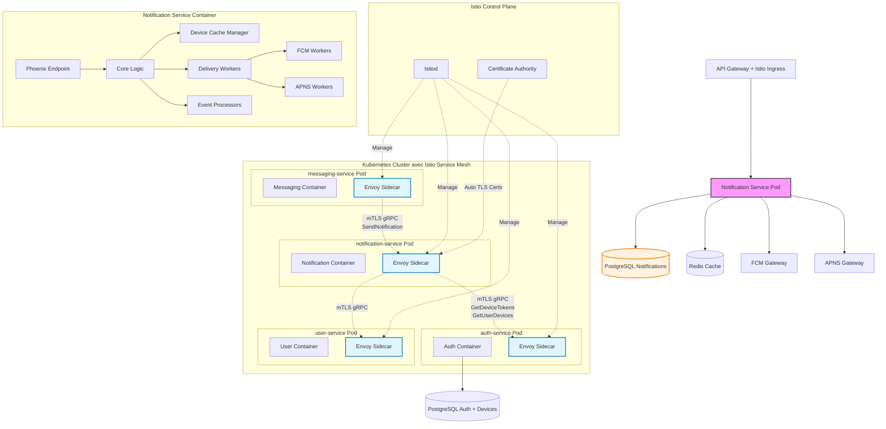
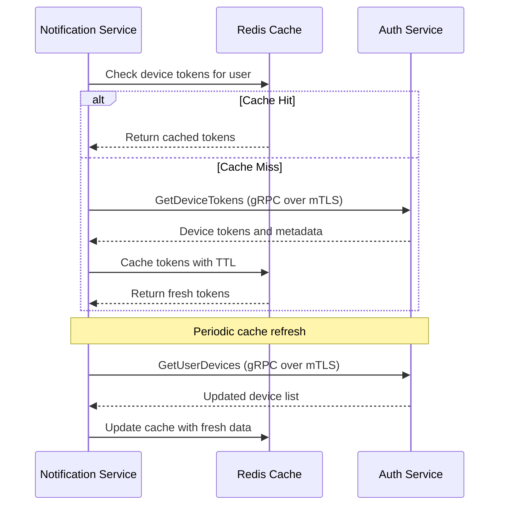
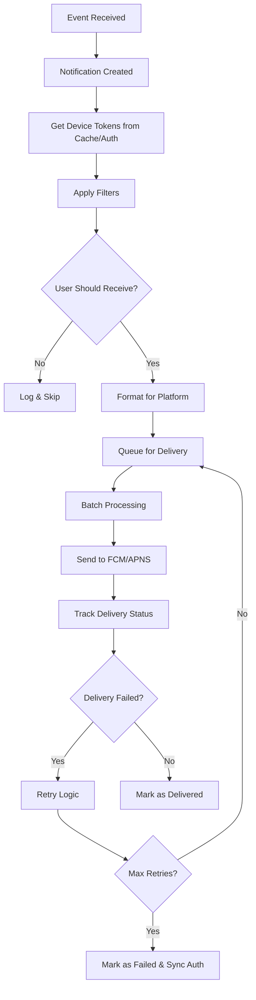
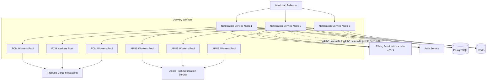

# Notification Service (`notification-service`) - System Design Document

## 0. Sommaire

- [1. Introduction](#1-introduction)
  - [1.1 Objectif du Document](#11-objectif-du-document)
  - [1.2 Périmètre du Service](#12-périmètre-du-service)
  - [1.3 Relations avec les Autres Services](#13-relations-avec-les-autres-services)
- [2. Architecture Globale](#2-architecture-globale)
  - [2.1 Vue d'Ensemble de l'Architecture avec Istio Service Mesh](#21-vue-densemble-de-larchitecture-avec-istio-service-mesh)
  - [2.2 Principes Architecturaux](#22-principes-architecturaux)
- [3. Choix Technologiques](#3-choix-technologiques)
  - [3.1 Stack Technique](#31-stack-technique)
  - [3.2 Infrastructure](#32-infrastructure)
- [4. Composants Principaux](#4-composants-principaux)
  - [4.1 Structure Phoenix/OTP](#41-structure-phoenixotp)
  - [4.2 Processus OTP et Superviseurs](#42-processus-otp-et-superviseurs)
  - [4.3 Cache des Appareils](#43-cache-des-appareils)
  - [4.4 Système de Filtrage des Notifications](#44-système-de-filtrage-des-notifications)
  - [4.5 Système de Livraison des Notifications](#45-système-de-livraison-des-notifications)
  - [4.6 Communication avec les autres services via Istio Service Mesh](#46-communication-avec-les-autres-services-via-istio-service-mesh)
    - [4.6.1 Configuration Istio pour notification-service](#461-configuration-istio-pour-notification-service)
  - [4.7 Configuration et Modules](#47-configuration-et-modules)
- [5. Scaling et Performances](#5-scaling-et-performances)
  - [5.1 Stratégie de Scaling](#51-stratégie-de-scaling)
  - [5.2 Cache et Optimisations](#52-cache-et-optimisations)
  - [5.3 Limites et Quotas avec Istio](#53-limites-et-quotas-avec-istio)
- [6. Monitoring et Observabilité](#6-monitoring-et-observabilité)
  - [6.1 Observabilité Istio](#61-observabilité-istio)
  - [6.2 Logging](#62-logging)
  - [6.3 Métriques](#63-métriques)
  - [6.4 Alerting](#64-alerting)
- [7. Gestion des Erreurs et Résilience](#7-gestion-des-erreurs-et-résilience)
  - [7.1 Stratégie de Gestion des Erreurs](#71-stratégie-de-gestion-des-erreurs)
  - [7.2 Résilience avec Istio](#72-résilience-avec-istio)
  - [7.3 Plan de Reprise d'Activité](#73-plan-de-reprise-dactivité)
- [8. Évolution et Maintenance](#8-évolution-et-maintenance)
  - [8.1 Versionnement](#81-versionnement)
  - [8.2 Mise à Jour et Déploiement](#82-mise-à-jour-et-déploiement)
  - [8.3 Documentation Technique](#83-documentation-technique)
- [9. Considérations Opérationnelles](#9-considérations-opérationnelles)
  - [9.1 DevOps](#91-devops)
  - [9.2 Environnements](#92-environnements)
  - [9.3 Support](#93-support)
- [Appendices](#appendices)
  - [A. Métriques de Performance Cibles](#a-métriques-de-performance-cibles)
  - [B. Estimation des Ressources](#b-estimation-des-ressources)
  - [C. Configuration Istio Examples](#c-configuration-istio-examples)
    - [C.1 PeerAuthentication (mTLS Strict)](#c1-peerauthentication-mtls-strict)
    - [C.2 AuthorizationPolicy pour notification-service](#c2-authorizationpolicy-pour-notification-service)
    - [C.3 DestinationRule avec Circuit Breaker](#c3-destinationrule-avec-circuit-breaker)
  - [D. Références](#d-références)

## 1. Introduction

### 1.1 Objectif du Document
Ce document décrit l'architecture et la conception technique du service de notifications (`notification-service`) de l'application Whispr. Il sert de référence pour l'équipe de développement et les parties prenantes du projet.

### 1.2 Périmètre du Service
Le Notification Service est responsable de la gestion des notifications push, des paramètres de notification personnalisés, et de la distribution des alertes aux utilisateurs via les canaux appropriés (FCM, APNS). Il maintient un cache léger des informations d'appareils et coordonne avec auth-service pour récupérer les données d'appareils nécessaires à l'envoi des notifications.

### 1.3 Relations avec les Autres Services
Le Notification Service interagit avec plusieurs autres microservices de l'écosystème Whispr via Istio Service Mesh :
- **auth-service** : pour la récupération des informations d'appareils et la validation des tokens d'authentification
- **user-service** : pour les informations de profil et les préférences utilisateur
- **messaging-service** : pour recevoir les événements de nouveaux messages
- **media-service** : pour les notifications liées aux médias partagés
- **moderation-service** : pour les alertes de modération

## 2. Architecture Globale

### 2.1 Vue d'Ensemble de l'Architecture avec Istio Service Mesh

Le service de notifications fonctionne dans un service mesh Istio qui sécurise automatiquement toutes les communications inter-services :



### 2.2 Principes Architecturaux

- **Haute concurrence** : Exploitation des capacités d'Elixir pour gérer des milliers de connexions simultanées
- **Zero Trust Network** : Toutes les communications inter-services sont chiffrées et authentifiées via mTLS automatique
- **Service Mesh Security** : Sécurité implémentée au niveau infrastructure via Istio
- **Tolérance aux pannes** : Structure de supervision OTP pour l'auto-guérison des processus
- **Approche événementielle** : Traitement asynchrone des événements de notification
- **Delivery garantie** : Mécanismes de retry et de persistance pour assurer la livraison
- **Scaling horizontal** : Distribution des workers de notification sur plusieurs nœuds avec load balancing Istio
- **Cache intelligent** : Cache léger des données d'appareils avec synchronisation auth-service
- **Observabilité** : Logging structuré, métriques détaillées et tracing distribué via Istio

## 3. Choix Technologiques

### 3.1 Stack Technique

- **Langage** : Elixir
- **Framework** : Phoenix (framework web pour Elixir)
- **Service Mesh** : Istio pour la sécurité et l'observabilité des communications inter-services
- **Proxy Sidecar** : Envoy (injecté automatiquement par Istio)
- **Sécurité Inter-Services** : mTLS automatique via Istio avec rotation de certificats
- **Base de données** : PostgreSQL avec Ecto pour les préférences et cache des tokens
- **Cache** : Redis pour les préférences utilisateur et le cache des informations d'appareils
- **Communication inter-services** : gRPC over mTLS automatique via Istio Service Mesh
- **ORM** : Ecto avec repositories
- **API** : REST avec documentation OpenAPI
- **Push Notifications** : FCM (Firebase Cloud Messaging) et APNS (Apple Push Notification Service)
- **Queues** : Intégration avec des files d'attente pour le traitement asynchrone
- **Testing** : ExUnit pour les tests unitaires et d'intégration

### 3.2 Infrastructure

- **Containerisation** : Docker
- **Orchestration** : Kubernetes (GKE)
- **Service Mesh** : Istio avec injection automatique de sidecars Envoy
- **Security** : mTLS automatique, AuthorizationPolicies et NetworkPolicies Istio
- **CI/CD** : GitHub Actions
- **Service Cloud** : Google Cloud Platform (GCP)
- **Monitoring** : Prometheus + Grafana + Kiali (Istio service topology)
- **Logging** : Loki + accès logs Envoy
- **Tracing** : Jaeger (intégré avec Istio pour le tracing distribué)
- **Certificate Management** : Istio CA pour la rotation automatique des certificats mTLS
- **Secrets Management** : Google Secret Manager pour les clés FCM/APNS

## 4. Composants Principaux

### 4.1 Structure Phoenix/OTP

L'architecture Phoenix/OTP du service est organisée comme suit :

```
lib/
├── whispr_notifications/              # Core domain logic
│   ├── application.ex                 # OTP Application entry point
│   ├── preferences/                   # User notification preferences
│   │   ├── user_settings.ex          # User-level notification settings
│   │   ├── conversation_settings.ex  # Conversation-specific settings
│   │   └── manager.ex                 # Preference management logic
│   ├── devices/                       # Device cache management
│   │   ├── device_cache.ex           # Device cache struct
│   │   ├── cache_manager.ex          # Device cache management
│   │   └── auth_client.ex            # gRPC client for auth-service
│   ├── notifications/                 # Notification processing
│   │   ├── notification.ex           # Notification struct and logic
│   │   ├── formatter.ex              # Platform-specific formatting
│   │   ├── filter.ex                 # Notification filtering logic
│   │   └── history.ex                # Notification history tracking
│   ├── delivery/                      # Notification delivery
│   │   ├── fcm_client.ex             # Firebase Cloud Messaging client
│   │   ├── apns_client.ex            # Apple Push Notification client
│   │   ├── batch_processor.ex        # Batch notification processing
│   │   └── retry_manager.ex          # Retry logic for failed deliveries
│   └── events/                        # Event processing
│       ├── message_events.ex         # Message-related events
│       ├── group_events.ex           # Group-related events
│       └── system_events.ex          # System notifications
├── whispr_notifications_web/          # Web layer
│   ├── endpoint.ex                    # Phoenix endpoint
│   ├── router.ex                      # Route definitions
│   ├── controllers/                   # REST API controllers
│   │   ├── settings_controller.ex    # Notification settings management
│   │   └── mute_controller.ex        # Conversation muting
│   ├── views/                         # Response formatting
│   └── plugs/                         # Custom request processing
├── whispr_notifications_grpc/         # gRPC service implementations
│   ├── server.ex                      # gRPC server setup
│   └── services/                      # gRPC service implementations
│       ├── notification_service.ex   # Main notification service
│       └── event_service.ex          # Event processing service
└── whispr_notifications_workers/      # Background workers
    ├── cleanup_worker.ex              # Notification history cleanup
    ├── metrics_worker.ex              # Telemetry and metrics
    ├── cache_sync_worker.ex           # Device cache synchronization
    └── token_refresher.ex             # Device token refresh
```

### 4.2 Processus OTP et Superviseurs

Le service utilise une hiérarchie de supervision pour garantir la résilience :

- **Application Supervisor** : Superviseur racine de l'application
  - **Endpoint Supervisor** : Gère le point d'entrée Phoenix
  - **DeviceCacheSupervisor** : Supervision du cache des appareils
  - **AuthClientSupervisor** : Supervision du client gRPC vers auth-service
  - **DeliveryWorkersSupervisor** : Gestion des workers de livraison
    - **FCMWorkerSupervisor** : Workers pour Firebase Cloud Messaging
    - **APNSWorkerSupervisor** : Workers pour Apple Push Notifications
  - **EventProcessorsSupervisor** : Supervision des processeurs d'événements
  - **WorkersSupervisor** : Gestion des tâches de fond
  - **gRPC Server Supervisor** : Supervision du serveur gRPC

### 4.3 Cache des Appareils

Le système de cache des appareils maintient une copie légère des informations depuis auth-service :



**Données cachées** :
- **Tokens FCM/APNS** : Pour l'envoi de notifications
- **Métadonnées basiques** : Platform, statut actif, dernière activité
- **Préférences par appareil** : Paramètres spécifiques stockés localement
- **TTL intelligent** : 30 minutes avec invalidation sur événements

### 4.4 Système de Filtrage des Notifications

Le cœur du filtrage s'articule autour de plusieurs composants :
- **PreferenceFilter** : Applique les préférences utilisateur globales
- **ConversationFilter** : Applique les paramètres spécifiques aux conversations
- **ScheduleFilter** : Respecte les horaires "Ne pas déranger"
- **ContentFilter** : Filtre selon le type de contenu
- **FrequencyFilter** : Limite la fréquence des notifications
- **DeviceFilter** : Filtre selon les appareils actifs (via cache auth-service)

### 4.5 Système de Livraison des Notifications



### 4.6 Communication avec les autres services via Istio Service Mesh

- **@grpc/phoenix_grpc**: pour l'intégration gRPC avec les autres services
- **mTLS automatique**: Toutes les communications gRPC sont automatiquement sécurisées par Istio
- **Service Discovery**: Résolution automatique des services via Istio et Kubernetes DNS
- **Load Balancing**: Répartition de charge automatique par Envoy proxies

**Interfaces gRPC consommées** :
- **auth-service** :
  - `GetDeviceTokens`: récupération des tokens FCM/APNS pour les notifications
  - `GetUserDevices`: liste des appareils d'un utilisateur
  - `ValidateDevice`: validation de l'authenticité d'un appareil

**Interfaces gRPC exposées** :
- **NotificationService** :
  - `SendNotification`: Envoi de notifications individuelles
  - `SendBulkNotifications`: Envoi de notifications en lot
  - `SendGroupNotifications`: Notifications spécifiques aux groupes
  - `NotifyDeviceEvent`: Réception d'événements d'appareils depuis auth-service

#### 4.6.1 Configuration Istio pour notification-service

```yaml
# AuthorizationPolicy pour notification-service vers auth-service
apiVersion: security.istio.io/v1beta1
kind: AuthorizationPolicy
metadata:
  name: notification-to-auth-devices
  namespace: whispr
spec:
  selector:
    matchLabels:
      app: auth-service
  rules:
  - from:
    - source:
        principals: ["cluster.local/ns/whispr/sa/notification-service"]
  - to:
    - operation:
        methods: ["GET"]
        paths: ["/auth.AuthService/GetDeviceTokens", "/auth.AuthService/GetUserDevices"]

---
# AuthorizationPolicy pour messaging-service vers notification-service
apiVersion: security.istio.io/v1beta1
kind: AuthorizationPolicy
metadata:
  name: messaging-to-notification
  namespace: whispr
spec:
  selector:
    matchLabels:
      app: notification-service
  rules:
  - from:
    - source:
        principals: ["cluster.local/ns/whispr/sa/messaging-service"]
  - to:
    - operation:
        methods: ["POST"]
        paths: ["/notification.NotificationService/SendNotification"]
```

### 4.7 Configuration et Modules

- **ConfigModule**: gestion des variables d'environnement Elixir
- **CacheModule**: intégration Redis pour le cache des appareils et des préférences
- **GrpcModule**: communication avec auth-service et autres microservices via Istio mTLS
- **DeliveryModule**: gestion des workers FCM/APNS
- **HealthModule**: health checks pour Kubernetes et Istio
- **TelemetryModule**: métriques et observabilité

## 5. Scaling et Performances

### 5.1 Stratégie de Scaling

- **Horizontal Pod Autoscaling (HPA)**: Scaling automatique basé sur CPU/mémoire et métriques personnalisées
- **Istio Load Balancing**: Répartition intelligente de charge avec plusieurs algorithmes (round-robin, least request, etc.)
- **Circuit Breakers**: Protection automatique contre les cascades de pannes via Istio
- **Répliques multiples**: Instances sans état pour faciliter le scaling
- **Health Checks**: Intégration avec les probes Kubernetes et Istio



### 5.2 Cache et Optimisations

- **Batch Processing** : Regroupement des notifications pour réduire les appels API
- **Connection Pooling** : Pools de connexions vers FCM/APNS et gRPC auth-service
- **Caching intelligent** :
  - Tokens d'appareils depuis auth-service (TTL: 30min)
  - Préférences utilisateur (TTL: 1h)
  - Paramètres de conversation (TTL: 30min)
- **Circuit Breakers Istio** : Protection contre les défaillances des services externes
- **Compression** : Compression des payloads pour réduire la bande passante
- **Load Balancing Istio** : Répartition intelligente de charge

### 5.3 Limites et Quotas avec Istio

- **Rate Limiting Istio**: Limitation de débit au niveau du service mesh
- **Per-User Rate Limiting**: Quotas personnalisés par utilisateur
- **Circuit Breaker Istio**: Protection automatique contre la surcharge
- Quotas sur les opérations sensibles (création de notifications, appels FCM/APNS)
- Timeout appropriés configurés via Istio VirtualService

| Métrique | Limite | Contrôle |
|----------|--------|----------|
| Notifications par utilisateur/jour | 1000 | Rate limiting Istio |
| Notifications par conversation/heure | 100 | Application level |
| Taille maximale du payload FCM | 4KB | Validation |
| Taille maximale du payload APNS | 2KB | Validation |
| Retry maximum par notification | 5 tentatives | Application logic |
| Délai maximum de retry | 24 heures | Timeout Istio |
| Appels gRPC vers auth-service/min | 1000 | Circuit breaker |

## 6. Monitoring et Observabilité

### 6.1 Observabilité Istio

- **Kiali** : Visualisation de la topologie du service mesh et health des services
- **Jaeger** : Tracing distribué automatique de toutes les requêtes inter-services
- **Prometheus** : Collecte automatique des métriques Istio et custom metrics
- **Grafana** : Dashboards pour les métriques système et business
- **Envoy Access Logs** : Logs détaillés de toutes les communications

### 6.2 Logging

- Logs structurés en JSON via Logger Elixir
- **Envoy Access Logs**: Logs automatiques de toutes les requêtes HTTP/gRPC
- **Distributed Tracing**: Corrélation automatique des logs via trace ID
- Utilisation du Plug Logger Phoenix pour le logging automatique des requêtes
- Niveaux de log différenciés (INFO, WARN, ERROR, DEBUG)
- Contexte inclus (userId, requestId, traceId, etc.)
- Sensibilité aux données personnelles (masquage)

### 6.3 Métriques

- **Métriques Istio automatiques**:
  - Latence des requêtes vers auth-service
  - Taux de succès/erreur des appels gRPC
  - Throughput des communications
  - Métriques de sécurité mTLS
- **Métriques métier personnalisées**:
  - Taux de livraison des notifications
  - Latence de livraison (création → livraison)
  - Taux d'ouverture des notifications
  - Taux d'erreur de livraison
  - Performance du cache des appareils
  - Synchronisation avec auth-service

### 6.4 Alerting

- **Alertes Istio** :
  - Dégradation de la connectivité vers auth-service
  - Échecs de certificats mTLS
  - Latence élevée dans le service mesh
- **Alertes business** :
  - Taux d'erreur élevé (> 5% d'échecs de livraison)
  - Latence élevée (> 10 secondes de délai moyen)
  - Service FCM/APNS indisponible
  - Cache d'appareils désynchronisé
  - Queue overflow (file d'attente pleine)
  - Mémoire critique (> 80% utilisation)

## 7. Gestion des Erreurs et Résilience

### 7.1 Stratégie de Gestion des Erreurs

- Utilisation des GenServer OTP pour la gestion centralisée des erreurs
- Superviseurs OTP pour l'auto-guérison des processus
- Logging structuré en JSON pour faciliter l'analyse
- **Correlation avec Istio tracing** : Chaque erreur est tracée dans Jaeger
- Gestion des timeouts et retry avec backoff exponentiel
- Notification des erreurs critiques aux autres services

### 7.2 Résilience avec Istio

- **Circuit Breakers Istio** : Protection automatique contre les services défaillants
- **Retry Policies** : Retries automatiques configurables via Istio VirtualService
- **Timeout Management** : Timeouts granulaires par service et opération
- **Outlier Detection** : Détection automatique et éviction des instances défaillantes
- **Traffic Shifting** : Basculement de trafic en cas de problème
- **Graceful Degradation** : Mode dégradé si auth-service indisponible

Le service implémente une stratégie de retry sophistiquée avec coordination auth-service :

1. **Échec immédiat** : Retry après 30 secondes
2. **Échec persistant** : Retry avec backoff exponentiel (1min, 5min, 15min, 1h)
3. **Échec critique** : Signaler à auth-service pour marquer l'appareil comme inactif après 24h d'échecs
4. **Token invalide** : Supprimer le token du cache et signaler à auth-service pour mise à jour

### 7.3 Plan de Reprise d'Activité

- RPO (Recovery Point Objective): 1 heure max
- RTO (Recovery Time Objective): 15 minutes max
- **Multi-AZ Deployment** : Déploiement dans plusieurs zones de disponibilité
- **Cache Redis** : Réplicas pour haute disponibilité
- Sauvegardes régulières de la base de données
- Procédures de restauration documentées

## 8. Évolution et Maintenance

### 8.1 Versionnement

- Versionnement sémantique des API
- **Traffic Routing Istio** : Déploiement progressif de nouvelles versions via traffic splitting
- **Canary Deployments** : Tests de nouvelles versions sur un pourcentage de trafic
- Rétrocompatibilité maintenue pour les clients existants
- Période de dépréciation avant suppression de fonctionnalités

### 8.2 Mise à Jour et Déploiement

- GitOps avec ArgoCD
- **Istio Rolling Updates** : Déploiement sans interruption via Istio
- **Blue/Green avec Istio** : Basculement de trafic instantané entre versions
- Tests automatisés avant déploiement
- Rollback automatique en cas d'échec via Istio traffic management
- Health Checks intégrés pour Kubernetes et Istio

### 8.3 Documentation Technique

- Documentation de l'API Phoenix générée automatiquement
- **Documentation Istio** : Configurations des policies de sécurité et traffic management
- Documentation de l'intégration avec auth-service
- Exemples de code pour l'intégration
- Guide de dépannage pour les problèmes courants
- Procédures opérationnelles (backup, restauration, scaling)

## 9. Considérations Opérationnelles

### 9.1 DevOps

- Pipeline CI/CD via GitHub Actions
- **Tests d'intégration Istio** : Validation des configurations service mesh
- **Security Scanning** : Analyse des configurations Istio pour les vulnérabilités
- Tests d'intégration avec auth-service
- Déploiement continu en environnement de développement et staging via ArgoCD

### 9.2 Environnements

- **Namespaces Kubernetes** : Isolation par environnement (dev, staging, prod)
- **Istio Traffic Management** : Routage par environnement
- **mTLS par environnement** : Certificats séparés par namespace
- Isolation complète des données entre environnements
- Parité des configurations Istio entre environnements

### 9.3 Support

- **Distributed Tracing** : Debugging facile via Jaeger
- **Service Topology** : Visualisation des dépendances via Kiali
- Logs centralisés pour le diagnostic
- **Istio Troubleshooting** : Outils intégrés pour diagnostiquer les problèmes de connectivité
- Procédures documentées pour les problèmes courants
- Monitoring de l'intégration avec auth-service

---

## Appendices

### A. Métriques de Performance Cibles

| Métrique | Cible | Monitoring |
|----------|-------|------------|
| Temps de réponse moyen | < 200ms | Prometheus + Grafana |
| 99e percentile temps de réponse | < 5s | Istio + Jaeger |
| Taux d'erreur | < 0.5% | Kiali + Prometheus |
| Disponibilité | > 99.5% | Istio Health Checks |
| Latence de livraison (P95) | < 5s | Custom metrics |
| Taux de livraison | > 95% | FCM/APNS metrics |
| Cache hit ratio (appareils) | > 85% | Redis metrics |
| Auth-service sync latency | < 100ms | gRPC metrics |
| mTLS Success Rate | > 99.9% | Istio metrics |

### B. Estimation des Ressources

| Ressource | Estimation Initiale | Istio Overhead |
|-----------|---------------------|----------------|
| Nœuds Elixir | 3 instances | + Envoy sidecars |
| CPU par nœud | 2 vCPU | + 0.1 vCPU (Envoy) |
| Mémoire par nœud | 4 GB RAM | + 200MB (Envoy) |
| Stockage PostgreSQL | 50 GB initial | - |
| Stockage Redis | 5 GB | - |
| Notifications par jour | 100,000 | - |
| Bandwidth mensuel | 20 GB | + mTLS overhead (~5%) |
| Istio Control Plane | - | 1 vCPU, 1GB RAM |

### C. Configuration Istio Examples

#### C.1 PeerAuthentication (mTLS Strict)
```yaml
apiVersion: security.istio.io/v1beta1
kind: PeerAuthentication
metadata:
  name: default
  namespace: whispr
spec:
  mtls:
    mode: STRICT
```

#### C.2 AuthorizationPolicy pour notification-service
```yaml
apiVersion: security.istio.io/v1beta1
kind: AuthorizationPolicy
metadata:
  name: notification-service-policy
  namespace: whispr
spec:
  selector:
    matchLabels:
      app: notification-service
  rules:
  - from:
    - source:
        principals: ["cluster.local/ns/whispr/sa/messaging-service"]
  - to:
    - operation:
        methods: ["POST"]
        paths: ["/notification.NotificationService/SendNotification"]
  - from:
    - source:
        principals: ["cluster.local/ns/whispr/sa/api-gateway"]
  - to:
    - operation:
        methods: ["GET", "PUT", "POST"]
```

#### C.3 DestinationRule avec Circuit Breaker
```yaml
apiVersion: networking.istio.io/v1beta1
kind: DestinationRule
metadata:
  name: notification-to-auth-circuit-breaker
  namespace: whispr
spec:
  host: auth-service
  trafficPolicy:
    outlierDetection:
      consecutiveErrors: 3
      interval: 30s
      baseEjectionTime: 30s
    circuitBreaker:
      maxConnections: 50
      maxRequestsPerConnection: 10
      maxRetries: 3
    connectionPool:
      grpc:
        maxRequestsPerConnection: 10
```

### D. Références

- [Schéma de Base de Données](./notification_service_data_model.md)
- [Politique de Sécurité Whispr](./notification_service_security_policy.md)
- [Spécifications Fonctionnelles](../2_functional_specs/notification_types_specs.md)
- [Documentation Firebase Cloud Messaging](https://firebase.google.com/docs/cloud-messaging)
- [Documentation Apple Push Notification Service](https://developer.apple.com/documentation/usernotifications)
- [Phoenix Framework Documentation](https://hexdocs.pm/phoenix/)
- [Elixir OTP Documentation](https://hexdocs.pm/elixir/GenServer.html)
- [Istio Documentation](https://istio.io/latest/docs/)
- [Istio Security Best Practices](https://istio.io/latest/docs/ops/best-practices/security/)
- [Best Practices for Push Notifications](https://developer.apple.com/library/archive/documentation/NetworkingInternet/Conceptual/RemoteNotificationsPG/)