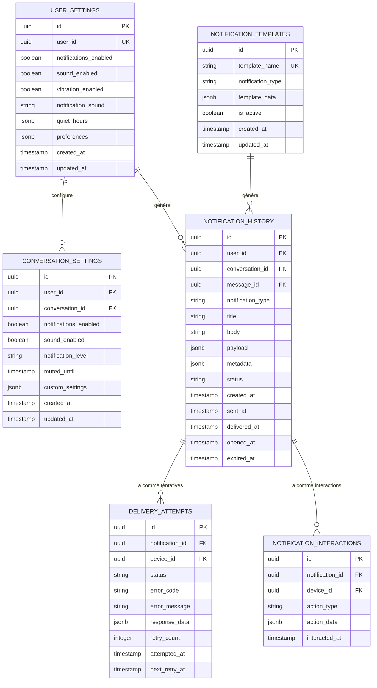
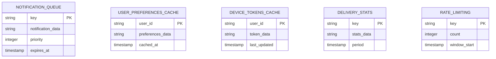
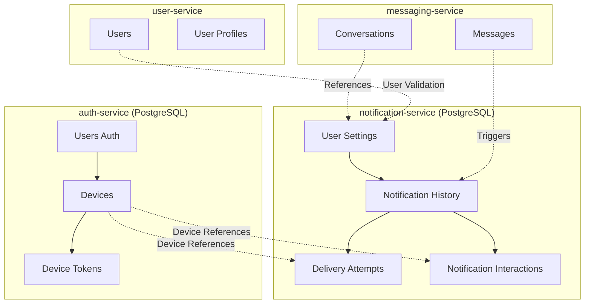
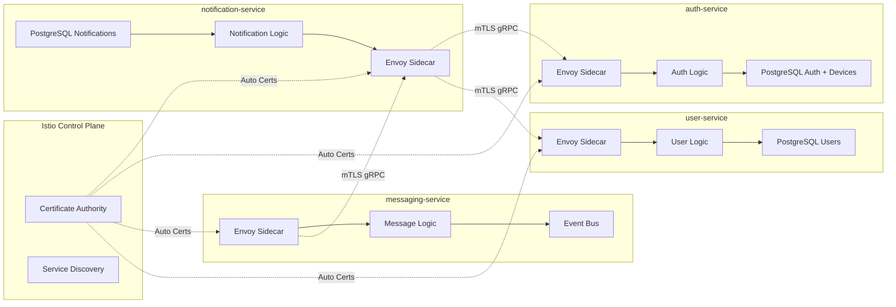

# Notification Service (`notification-service`) - Conception de la Base de Données

## 0. Sommaire

- [1. Introduction et Principes de Conception](#1-introduction-et-principes-de-conception)
  - [1.1 Objectif](#11-objectif)
  - [1.2 Principes Architecturaux](#12-principes-architecturaux)
  - [1.3 Technologie](#13-technologie)
- [2. Schéma PostgreSQL du Service de Notifications](#2-schéma-postgresql-du-service-de-notifications)
  - [2.1 Vue d'Ensemble](#21-vue-densemble)
  - [2.2 Description des Tables](#22-description-des-tables)
- [3. Données Temporaires dans Redis](#3-données-temporaires-dans-redis)
  - [3.1 Vue d'Ensemble](#31-vue-densemble)
  - [3.2 Description des Structures Redis](#32-description-des-structures-redis)
- [4. Relations avec les Autres Services](#4-relations-avec-les-autres-services)
  - [4.1 Démarcation des Responsabilités](#41-démarcation-des-responsabilités)
  - [4.2 Synchronisation des Données](#42-synchronisation-des-données)
- [5. Considérations de Sécurité](#5-considérations-de-sécurité)
  - [5.1 Chiffrement des Données Sensibles](#51-chiffrement-des-données-sensibles)
  - [5.2 Protection des Tokens d'Appareil](#52-protection-des-tokens-dappareil)
  - [5.3 Audit et Logging](#53-audit-et-logging)
- [6. Considérations de Performance](#6-considérations-de-performance)
  - [6.1 Indexation](#61-indexation)
  - [6.2 Partitionnement](#62-partitionnement)
  - [6.3 Optimisations Redis](#63-optimisations-redis)
- [7. Migrations et Évolution du Schéma](#7-migrations-et-évolution-du-schéma)
  - [7.1 Stratégie de Migration](#71-stratégie-de-migration)
- [8. Scripts SQL d'Initialisation](#8-scripts-sql-dinitialisation)
  - [8.1 Création du Schéma PostgreSQL](#81-création-du-schéma-postgresql)
- [9. Communication Inter-Services avec Istio](#9-communication-inter-services-avec-istio)
  - [9.1 Architecture Service Mesh pour les Données](#91-architecture-service-mesh-pour-les-données)
  - [9.2 Événements et Synchronisation avec mTLS](#92-événements-et-synchronisation-avec-mtls)
  - [9.3 Gestion des Références Externes avec Istio](#93-gestion-des-références-externes-avec-istio)
  - [9.4 Monitoring des Données Inter-Services](#94-monitoring-des-données-inter-services)
  - [9.5 Résilience des Données](#95-résilience-des-données)

## 1. Introduction et Principes de Conception

### 1.1 Objectif
Ce document décrit la structure de la base de données du service de notifications (notification-service) de l'application Whispr, en détaillant les modèles de données, les relations, et les considérations de performance pour la gestion des notifications push, des préférences utilisateur et du suivi des livraisons.

### 1.2 Principes Architecturaux
- **Optimisation pour la concurrence massive**: Structures conçues pour traiter des milliers de notifications simultanément
- **Distribution Erlang/OTP**: Support du modèle multi-nœuds d'Elixir pour le scaling horizontal
- **Séparation des domaines**: Données de notification isolées des autres services
- **Cache intelligent**: Optimisation pour l'application rapide des préférences utilisateur
- **Haute disponibilité**: Conception permettant la résilience et la continuité de service
- **Traçabilité complète**: Suivi détaillé des livraisons et interactions utilisateur

### 1.3 Technologie
- **PostgreSQL**: Pour le stockage persistant des préférences, historiques et appareils
- **Ecto**: ORM pour Elixir utilisé pour l'accès aux données
- **Redis**: Pour les données temporaires, queues et coordination des nœuds Elixir
- **ETS/Mnesia**: Tables en mémoire d'Erlang pour les préférences fréquemment accédées

## 2. Schéma PostgreSQL du Service de Notifications

### 2.1 Vue d'Ensemble



### 2.2 Description des Tables

#### 2.2.1 USER_SETTINGS
Stocke les préférences de notification globales pour chaque utilisateur.

| Colonne | Type | Description | Contraintes |
|---------|------|-------------|-------------|
| id | UUID | Identifiant unique des paramètres | PK, NOT NULL |
| user_id | UUID | Identifiant de l'utilisateur | UNIQUE, NOT NULL |
| notifications_enabled | BOOLEAN | Notifications activées globalement | NOT NULL, DEFAULT TRUE |
| sound_enabled | BOOLEAN | Son des notifications activé | NOT NULL, DEFAULT TRUE |
| vibration_enabled | BOOLEAN | Vibration des notifications activée | NOT NULL, DEFAULT TRUE |
| notification_sound | VARCHAR(100) | Son personnalisé pour les notifications | DEFAULT 'default' |
| quiet_hours | JSONB | Horaires "Ne pas déranger" | NOT NULL, DEFAULT '{}' |
| preferences | JSONB | Préférences avancées personnalisées | NOT NULL, DEFAULT '{}' |
| created_at | TIMESTAMP | Date/heure de création | NOT NULL |
| updated_at | TIMESTAMP | Date/heure de mise à jour | NOT NULL |

**Indices**:
- PRIMARY KEY sur `id`
- UNIQUE sur `user_id`
- INDEX sur `notifications_enabled` pour filtrage rapide
- INDEX sur `updated_at` pour synchro cache

#### 2.2.2 CONVERSATION_SETTINGS
Stocke les préférences de notification spécifiques par conversation.

| Colonne | Type | Description | Contraintes |
|---------|------|-------------|-------------|
| id | UUID | Identifiant unique des paramètres | PK, NOT NULL |
| user_id | UUID | Identifiant de l'utilisateur | NOT NULL |
| conversation_id | UUID | Identifiant de la conversation | NOT NULL |
| notifications_enabled | BOOLEAN | Notifications activées pour cette conversation | NOT NULL, DEFAULT TRUE |
| sound_enabled | BOOLEAN | Son activé pour cette conversation | NOT NULL, DEFAULT TRUE |
| notification_level | VARCHAR(20) | Niveau de notification | DEFAULT 'all' |
| muted_until | TIMESTAMP | Conversation en sourdine jusqu'à | NULL |
| custom_settings | JSONB | Paramètres personnalisés | NOT NULL, DEFAULT '{}' |
| created_at | TIMESTAMP | Date/heure de création | NOT NULL |
| updated_at | TIMESTAMP | Date/heure de mise à jour | NOT NULL |

**Indices**:
- PRIMARY KEY sur `id`
- UNIQUE sur `(user_id, conversation_id)`
- INDEX sur `user_id` pour récupération rapide
- INDEX sur `muted_until` pour nettoyage automatique

#### 2.2.3 NOTIFICATION_HISTORY
Stocke l'historique complet des notifications envoyées (partitionnée par date).

| Colonne | Type | Description | Contraintes |
|---------|------|-------------|-------------|
| id | UUID | Identifiant unique de la notification | NOT NULL |
| user_id | UUID | Destinataire de la notification | NOT NULL |
| conversation_id | UUID | Conversation liée (peut être NULL) | NULL |
| message_id | UUID | Message lié (peut être NULL) | NULL |
| notification_type | VARCHAR(50) | Type de notification | NOT NULL |
| title | VARCHAR(255) | Titre de la notification | NOT NULL |
| body | TEXT | Corps de la notification | NOT NULL |
| payload | JSONB | Données de la notification | NOT NULL, DEFAULT '{}' |
| metadata | JSONB | Métadonnées supplémentaires | NOT NULL, DEFAULT '{}' |
| status | VARCHAR(20) | Statut de la notification | NOT NULL, DEFAULT 'pending' |
| created_at | TIMESTAMP | Date/heure de création | NOT NULL |
| sent_at | TIMESTAMP | Date/heure d'envoi | NULL |
| delivered_at | TIMESTAMP | Date/heure de livraison | NULL |
| opened_at | TIMESTAMP | Date/heure d'ouverture | NULL |
| expired_at | TIMESTAMP | Date/heure d'expiration | NULL |

**Contraintes**:
- PRIMARY KEY sur `(created_at, id)` pour le partitionnement
- PARTITION BY RANGE sur `created_at`

#### 2.2.4 DELIVERY_ATTEMPTS
Stocke les tentatives de livraison des notifications vers les appareils.

| Colonne | Type | Description | Contraintes |
|---------|------|-------------|-------------|
| id | UUID | Identifiant unique de la tentative | PK, NOT NULL |
| notification_id | UUID | Référence à la notification | FK, NOT NULL |
| device_id | UUID | Référence à l'appareil (auth-service) | NOT NULL |
| status | VARCHAR(20) | Statut de la tentative | NOT NULL |
| error_code | VARCHAR(50) | Code d'erreur si échec | NULL |
| error_message | TEXT | Message d'erreur détaillé | NULL |
| response_data | JSONB | Réponse complète du service push | NULL |
| retry_count | INTEGER | Nombre de tentatives | NOT NULL, DEFAULT 0 |
| attempted_at | TIMESTAMP | Date/heure de la tentative | NOT NULL |
| next_retry_at | TIMESTAMP | Date/heure de prochaine tentative | NULL |

**Indices**:
- PRIMARY KEY sur `id`
- INDEX sur `notification_id` pour récupération par notification
- INDEX sur `device_id` pour statistiques par appareil
- INDEX sur `next_retry_at` pour planning des retry

**Note**: Le `device_id` référence maintenant un appareil géré par auth-service et ne fait plus l'objet d'une contrainte de clé étrangère locale.

#### 2.2.5 NOTIFICATION_INTERACTIONS
Stocke les interactions utilisateur avec les notifications.

| Colonne | Type | Description | Contraintes |
|---------|------|-------------|-------------|
| id | UUID | Identifiant unique de l'interaction | PK, NOT NULL |
| notification_id | UUID | Référence à la notification | FK, NOT NULL |
| device_id | UUID | Référence à l'appareil (auth-service) | NOT NULL |
| action_type | VARCHAR(50) | Type d'action (opened, dismissed, etc.) | NOT NULL |
| action_data | JSONB | Données supplémentaires de l'action | NOT NULL, DEFAULT '{}' |
| interacted_at | TIMESTAMP | Date/heure de l'interaction | NOT NULL |

**Indices**:
- PRIMARY KEY sur `id`
- INDEX sur `notification_id` pour récupération par notification
- INDEX sur `action_type` pour métriques d'engagement

**Note**: Le `device_id` référence un appareil géré par auth-service.

#### 2.2.6 NOTIFICATION_TEMPLATES
Stocke les templates de notifications pour différents types d'événements.

| Colonne | Type | Description | Contraintes |
|---------|------|-------------|-------------|
| id | UUID | Identifiant unique du template | PK, NOT NULL |
| template_name | VARCHAR(100) | Nom unique du template | UNIQUE, NOT NULL |
| notification_type | VARCHAR(50) | Type de notification associé | NOT NULL |
| template_data | JSONB | Structure du template avec variables | NOT NULL |
| is_active | BOOLEAN | Template actif | NOT NULL, DEFAULT TRUE |
| created_at | TIMESTAMP | Date/heure de création | NOT NULL |
| updated_at | TIMESTAMP | Date/heure de mise à jour | NOT NULL |

**Indices**:
- PRIMARY KEY sur `id`
- UNIQUE sur `template_name`
- INDEX sur `notification_type` pour récupération par type

## 3. Données Temporaires dans Redis

### 3.1 Vue d'Ensemble

Redis est utilisé pour les données à accès fréquent, les queues de notification et la coordination entre nœuds Elixir :



### 3.2 Description des Structures Redis

#### 3.2.1 NOTIFICATION_QUEUE
Files d'attente prioritaires pour les notifications en attente de traitement.

**Clé**: `notification:queue:{priority}`  
**Type**: Sorted Set  
**TTL**: 24 heures  
**Valeurs**:
- Données de notification sérialisées en JSON
- Score: timestamp + priorité pour ordre de traitement
- Supports multiples queues par priorité (high, medium, low)

#### 3.2.2 USER_PREFERENCES_CACHE
Cache des préférences utilisateur pour éviter les requêtes fréquentes en base.

**Clé**: `preferences:user:{userId}`  
**Type**: Hash  
**TTL**: 1 heure  
**Champs**:
- `global_settings`: préférences globales sérialisées
- `conversation_settings`: map des paramètres par conversation
- `quiet_hours`: horaires de silence
- `last_updated`: timestamp de dernière mise à jour

#### 3.2.3 DEVICE_TOKENS_CACHE
Cache des tokens d'appareil pour distribution rapide.

**Clé**: `device:tokens:{userId}`  
**Type**: Hash  
**TTL**: 30 minutes  
**Champs**:
- `ios_tokens`: liste des tokens iOS actifs
- `android_tokens`: liste des tokens Android actifs
- `web_tokens`: liste des tokens Web Push actifs
- `last_refresh`: timestamp de dernière synchronisation

#### 3.2.4 DELIVERY_STATS
Statistiques de livraison en temps réel pour monitoring.

**Clé**: `stats:delivery:{period}:{type}`  
**Type**: Hash  
**TTL**: Variable selon la période (1h, 24h, 7j)  
**Champs**:
- `sent`: nombre de notifications envoyées
- `delivered`: nombre de notifications livrées
- `failed`: nombre d'échecs
- `opened`: nombre d'ouvertures
- `rate`: taux de livraison calculé

#### 3.2.5 RATE_LIMITING
Limitation du taux d'envoi de notifications par utilisateur/IP.

**Clé**: `ratelimit:{type}:{identifier}`  
**Type**: String avec compteur  
**TTL**: Fenêtre de temps (1 minute, 1 heure, 24 heures)  
**Valeur**: Compteur d'opérations dans la fenêtre

## 4. Relations avec les Autres Services

### 4.1 Démarcation des Responsabilités



### 4.2 Synchronisation des Données

- **messaging-service**: Source des événements de notification
  - Déclenchement de notifications lors de nouveaux messages
  - Référence aux conversations et messages sans réplication

- **user-service**: Source de vérité pour les utilisateurs
  - Validation des identifiants utilisateur
  - Pas de réplication des données utilisateur

- **auth-service**: Source de vérité pour les appareils
  - Gestion centralisée des tokens d'appareils et métadonnées
  - Le notification-service récupère les informations d'appareils via gRPC
  - Cache local des tokens pour les performances
  - Références par `device_id` dans les tables de livraison et interactions

## 5. Considérations de Sécurité

### 5.1 Chiffrement des Données Sensibles

- **Niveau Colonne**: Les tokens d'appareil sont chiffrés au repos avec AES-256-GCM
- **Rotation des clés**: Clés de chiffrement rotées automatiquement tous les 90 jours
- **Secrets Management**: Clés stockées dans Google Secret Manager

### 5.2 Protection des Tokens d'Appareil

- **Tokens gérés par auth-service**: Les tokens d'appareil sont stockés et chiffrés dans auth-service
- **Cache sécurisé**: Cache local des tokens avec chiffrement en mémoire
- **Validation des tokens**: Vérification de la validité via auth-service avant envoi
- **Références sécurisées**: Utilisation de `device_id` pour référencer les appareils sans stocker de données sensibles
- **TTL intelligent**: Expiration automatique du cache pour limiter l'exposition

### 5.3 Audit et Logging

- **Journalisation des envois**: Toutes les notifications sont loggées
- **Tracking des accès**: Suivi des accès aux préférences utilisateur
- **Anonymisation**: Logs de debug anonymisés pour la protection des données
- **Rétention**: Politique de rétention différenciée selon le type de données

## 6. Considérations de Performance

### 6.1 Indexation

- Index composites pour les requêtes courantes (`user_id`, `created_at`)
- Index partiels pour les appareils actifs
- Index sur les timestamps pour les requêtes temporelles
- Index GIN sur les colonnes JSONB pour les recherches dans les métadonnées

### 6.2 Partitionnement

```sql
-- Partitionnement de l'historique par mois
CREATE TABLE notification_history (
    id UUID NOT NULL,
    created_at TIMESTAMP NOT NULL,
    -- autres colonnes
    PRIMARY KEY (created_at, id)
) PARTITION BY RANGE (created_at);

-- Partitions mensuelles automatiques
CREATE TABLE notification_history_2025_01 PARTITION OF notification_history
    FOR VALUES FROM ('2025-01-01') TO ('2025-02-01');
```

### 6.3 Optimisations Redis

- TTL appropriés selon l'usage des données
- Pipeline Redis pour les opérations en lot
- Compression des données en cache pour réduire l'usage mémoire
- Sharding Redis pour la haute disponibilité

## 7. Migrations et Évolution du Schéma

### 7.1 Stratégie de Migration

- **Migrations Ecto**: Migrations progressives avec versionnement
- **Zero Downtime**: Migrations compatibles avec le déploiement sans interruption
- **Rollback**: Possibilité de rollback pour toutes les migrations
- **Tests automatisés**: Validation automatique des migrations

```elixir
defmodule WhisprNotifications.Repo.Migrations.CreateNotificationHistory do
  use Ecto.Migration

  def up do
    create table(:notification_history, primary_key: false) do
      add :id, :binary_id, null: false
      add :user_id, :binary_id, null: false
      add :created_at, :utc_datetime, null: false
      # autres colonnes
    end
    
    # Création des partitions initiales
    execute "CREATE TABLE notification_history_2025_01 PARTITION OF notification_history
             FOR VALUES FROM ('2025-01-01') TO ('2025-02-01')"
  end

  def down do
    drop table(:notification_history)
  end
end
```

## 8. Scripts SQL d'Initialisation

### 8.1 Création du Schéma PostgreSQL

```sql
CREATE EXTENSION IF NOT EXISTS "uuid-ossp";
CREATE EXTENSION IF NOT EXISTS "pgcrypto";

-- Table des paramètres utilisateur
CREATE TABLE user_settings (
    id UUID PRIMARY KEY DEFAULT uuid_generate_v4(),
    user_id UUID NOT NULL UNIQUE,
    notifications_enabled BOOLEAN NOT NULL DEFAULT TRUE,
    sound_enabled BOOLEAN NOT NULL DEFAULT TRUE,
    vibration_enabled BOOLEAN NOT NULL DEFAULT TRUE,
    notification_sound VARCHAR(100) DEFAULT 'default',
    quiet_hours JSONB NOT NULL DEFAULT '{}',
    preferences JSONB NOT NULL DEFAULT '{}',
    created_at TIMESTAMP NOT NULL DEFAULT NOW(),
    updated_at TIMESTAMP NOT NULL DEFAULT NOW()
);

-- Table des paramètres par conversation
CREATE TABLE conversation_settings (
    id UUID PRIMARY KEY DEFAULT uuid_generate_v4(),
    user_id UUID NOT NULL,
    conversation_id UUID NOT NULL,
    notifications_enabled BOOLEAN NOT NULL DEFAULT TRUE,
    sound_enabled BOOLEAN NOT NULL DEFAULT TRUE,
    notification_level VARCHAR(20) NOT NULL DEFAULT 'all',
    muted_until TIMESTAMP,
    custom_settings JSONB NOT NULL DEFAULT '{}',
    created_at TIMESTAMP NOT NULL DEFAULT NOW(),
    updated_at TIMESTAMP NOT NULL DEFAULT NOW(),
    UNIQUE(user_id, conversation_id)
);

-- Table des appareils
CREATE TABLE devices (
    id UUID PRIMARY KEY DEFAULT uuid_generate_v4(),
    user_id UUID NOT NULL,
    platform VARCHAR(20) NOT NULL CHECK (platform IN ('ios', 'android', 'web')),
    token TEXT NOT NULL,
    device_id VARCHAR(255) NOT NULL UNIQUE,
    metadata JSONB NOT NULL DEFAULT '{}',
    is_active BOOLEAN NOT NULL DEFAULT TRUE,
    last_seen TIMESTAMP NOT NULL DEFAULT NOW(),
    registered_at TIMESTAMP NOT NULL DEFAULT NOW(),
    updated_at TIMESTAMP NOT NULL DEFAULT NOW()
);

-- Table de l'historique des notifications (partitionnée)
CREATE TABLE notification_history (
    id UUID NOT NULL,
    user_id UUID NOT NULL,
    conversation_id UUID,
    message_id UUID,
    notification_type VARCHAR(50) NOT NULL,
    title VARCHAR(255) NOT NULL,
    body TEXT NOT NULL,
    payload JSONB NOT NULL DEFAULT '{}',
    metadata JSONB NOT NULL DEFAULT '{}',
    status VARCHAR(20) NOT NULL DEFAULT 'pending',
    created_at TIMESTAMP NOT NULL DEFAULT NOW(),
    sent_at TIMESTAMP,
    delivered_at TIMESTAMP,
    opened_at TIMESTAMP,
    expired_at TIMESTAMP,
    PRIMARY KEY (created_at, id)
) PARTITION BY RANGE (created_at);

-- Partitions initiales
CREATE TABLE notification_history_2025_01 PARTITION OF notification_history
    FOR VALUES FROM ('2025-01-01') TO ('2025-02-01');
CREATE TABLE notification_history_2025_02 PARTITION OF notification_history
    FOR VALUES FROM ('2025-02-01') TO ('2025-03-01');

-- Table des tentatives de livraison
CREATE TABLE delivery_attempts (
    id UUID PRIMARY KEY DEFAULT uuid_generate_v4(),
    notification_id UUID NOT NULL,
    device_id UUID NOT NULL REFERENCES devices(id) ON DELETE CASCADE,
    status VARCHAR(20) NOT NULL,
    error_code VARCHAR(50),
    error_message TEXT,
    response_data JSONB,
    retry_count INTEGER NOT NULL DEFAULT 0,
    attempted_at TIMESTAMP NOT NULL DEFAULT NOW(),
    next_retry_at TIMESTAMP
);

-- Table des interactions
CREATE TABLE notification_interactions (
    id UUID PRIMARY KEY DEFAULT uuid_generate_v4(),
    notification_id UUID NOT NULL,
    device_id UUID NOT NULL REFERENCES devices(id) ON DELETE CASCADE,
    action_type VARCHAR(50) NOT NULL,
    action_data JSONB NOT NULL DEFAULT '{}',
    interacted_at TIMESTAMP NOT NULL DEFAULT NOW()
);

-- Table des templates
CREATE TABLE notification_templates (
    id UUID PRIMARY KEY DEFAULT uuid_generate_v4(),
    template_name VARCHAR(100) NOT NULL UNIQUE,
    notification_type VARCHAR(50) NOT NULL,
    template_data JSONB NOT NULL,
    is_active BOOLEAN NOT NULL DEFAULT TRUE,
    created_at TIMESTAMP NOT NULL DEFAULT NOW(),
    updated_at TIMESTAMP NOT NULL DEFAULT NOW()
);

-- Index essentiels
CREATE INDEX idx_user_settings_user_id ON user_settings(user_id);
CREATE INDEX idx_user_settings_notifications_enabled ON user_settings(notifications_enabled);
CREATE INDEX idx_conversation_settings_user_id ON conversation_settings(user_id);
CREATE INDEX idx_conversation_settings_muted_until ON conversation_settings(muted_until);
CREATE INDEX idx_delivery_attempts_notification_id ON delivery_attempts(notification_id);
CREATE INDEX idx_delivery_attempts_device_id ON delivery_attempts(device_id);
CREATE INDEX idx_delivery_attempts_next_retry_at ON delivery_attempts(next_retry_at);
CREATE INDEX idx_notification_interactions_notification_id ON notification_interactions(notification_id);
CREATE INDEX idx_notification_interactions_device_id ON notification_interactions(device_id);

-- Triggers pour updated_at
CREATE OR REPLACE FUNCTION update_timestamp()
RETURNS TRIGGER AS $
BEGIN
   NEW.updated_at = NOW();
   RETURN NEW;
END;
$ LANGUAGE plpgsql;

CREATE TRIGGER update_user_settings_timestamp
BEFORE UPDATE ON user_settings
FOR EACH ROW EXECUTE PROCEDURE update_timestamp();

CREATE TRIGGER update_conversation_settings_timestamp
BEFORE UPDATE ON conversation_settings
FOR EACH ROW EXECUTE PROCEDURE update_timestamp();

-- Templates par défaut
INSERT INTO notification_templates (template_name, notification_type, template_data) VALUES
('new_message', 'message', '{"title": "{{sender_name}}", "body": "{{message_preview}}", "sound": "default"}'),
('group_message', 'message', '{"title": "{{group_name}}", "body": "{{sender_name}}: {{message_preview}}", "sound": "default"}'),
('group_invitation', 'group', '{"title": "Nouvelle invitation", "body": "{{inviter_name}} vous a ajouté au groupe {{group_name}}", "sound": "default"}'),
('mention', 'message', '{"title": "{{sender_name}} vous a mentionné", "body": "{{message_preview}}", "sound": "mention"}');
```

## 9. Communication Inter-Services avec Istio

### 9.1 Architecture Service Mesh pour les Données

Le notification-service communique avec les autres services via Istio Service Mesh pour la synchronisation des données :



### 9.2 Événements et Synchronisation avec mTLS

#### 9.2.1 Communications Sécurisées
- **mTLS automatique** : Toutes les communications gRPC sont automatiquement chiffrées et authentifiées
- **Service Identity** : Chaque service a une identité cryptographique unique via SPIFFE
- **Certificate Rotation** : Rotation automatique des certificats par Istio CA
- **Zero Trust** : Aucune communication en clair entre services

#### 9.2.2 Patterns de Synchronisation des Données

**Synchronisation des appareils** (auth-service → notification-service):
```yaml
# AuthorizationPolicy pour la synchronisation des appareils
apiVersion: security.istio.io/v1beta1
kind: AuthorizationPolicy
metadata:
  name: auth-to-notification-devices
  namespace: whispr
spec:
  selector:
    matchLabels:
      app: notification-service
  rules:
  - from:
    - source:
        principals: ["cluster.local/ns/whispr/sa/auth-service"]
  - to:
    - operation:
        methods: ["POST", "PUT", "DELETE"]
        paths: ["/notification.DeviceService/SyncDevices", "/notification.DeviceService/UpdateDevice"]
```

**Événements de messages** (messaging-service → notification-service):
```yaml
# AuthorizationPolicy pour les événements de notification
apiVersion: security.istio.io/v1beta1
kind: AuthorizationPolicy
metadata:
  name: messaging-to-notification-events
  namespace: whispr
spec:
  selector:
    matchLabels:
      app: notification-service
  rules:
  - from:
    - source:
        principals: ["cluster.local/ns/whispr/sa/messaging-service"]
  - to:
    - operation:
        methods: ["POST"]
        paths: ["/notification.NotificationService/SendNotification"]
```

### 9.3 Gestion des Références Externes avec Istio

#### 9.3.1 Consistance des Données
- **Eventual Consistency** : Les données d'appareils sont synchronisées de manière asynchrone depuis auth-service
- **Cache Invalidation** : Invalidation des caches lors de la synchronisation
- **Conflict Resolution** : Résolution des conflits de tokens d'appareils
- **Graceful Degradation** : Mode dégradé si auth-service est indisponible

#### 9.3.2 Récupération des Informations d'Appareils

```elixir
# Module pour récupérer les informations d'appareils depuis auth-service
defmodule WhisprNotifications.DeviceClient do
  @moduledoc """
  Client gRPC pour récupérer les informations d'appareils depuis auth-service
  """
  
  def get_user_devices(user_id) do
    case AuthService.GetUserDevices.call(%{user_id: user_id}) do
      {:ok, devices} ->
        # Mettre en cache les tokens d'appareils
        cache_device_tokens(user_id, devices)
        {:ok, devices}
      
      {:error, :unavailable} ->
        # Mode dégradé : utiliser le cache local
        Logger.warn("Auth service unavailable, using cached device tokens")
        get_cached_device_tokens(user_id)
    end
  end
  
  def get_device_info(device_id) do
    case AuthService.GetDeviceInfo.call(%{device_id: device_id}) do
      {:ok, device} -> {:ok, device}
      {:error, :not_found} -> {:error, :device_not_found}
      {:error, :unavailable} -> get_cached_device_info(device_id)
    end
  end
  
  defp cache_device_tokens(user_id, devices) do
    # Stocker dans Redis pour accès rapide
    tokens_by_platform = Enum.group_by(devices, & &1.platform, & &1.token)
    DeviceCache.put_user_tokens(user_id, tokens_by_platform)
  end
end
```

### 9.4 Monitoring des Données Inter-Services

#### 9.4.1 Métriques de Synchronisation
- **Device Sync Success Rate** : Taux de succès des synchronisations d'appareils
- **Auth Service Latency** : Latence des appels vers auth-service
- **Cache Hit Ratio** : Efficacité du cache des appareils
- **Notification Delivery Rate** : Taux de livraison des notifications

#### 9.4.2 Alertes de Cohérence
- **Device Sync Failures** : Échecs de synchronisation avec auth-service
- **Orphaned Notifications** : Notifications pour des appareils inexistants
- **Token Validation Errors** : Erreurs de validation des tokens d'appareils
- **Cache Inconsistency** : Incohérences entre cache et base de données

### 9.5 Résilience des Données

#### 9.5.1 Stratégies de Fallback
- **Cached Device Data** : Utilisation des données d'appareils en cache si auth-service indisponible
- **Retry with Backoff** : Stratégies de retry pour les synchronisations échouées
- **Circuit Breaker** : Protection contre les pannes en cascade
- **Degraded Mode** : Mode dégradé avec fonctionnalités limitées

#### 9.5.2 Recovery Procedures
- **Device Cache Reconciliation** : Réconciliation du cache d'appareils avec auth-service après reprise
- **Notification Replay** : Rejouer les notifications échouées
- **Cache Warming** : Réchauffement du cache des tokens d'appareils après redémarrage
- **Health Checks** : Vérification de la disponibilité d'auth-service

```elixir
# Health check pour la disponibilité des données d'appareils
defmodule WhisprNotifications.HealthChecks.DeviceAvailability do
  def check_auth_service_connectivity do
    # Vérifier que auth-service est accessible pour les données d'appareils
    case AuthService.HealthCheck.call(%{}) do
      {:ok, _} -> :ok
      {:error, :unavailable} -> 
        Logger.error("Auth service unavailable for device data")
        {:error, :auth_service_unavailable}
    end
  end
  
  def check_device_cache_freshness(user_id) do
    # Vérifier que le cache des appareils n'est pas trop ancien
    case DeviceCache.get_last_refresh(user_id) do
      {:ok, last_refresh} ->
        if DateTime.diff(DateTime.utc_now(), last_refresh, :minute) > 30 do
          {:warning, :cache_stale}
        else
          :ok
        end
      {:error, :not_found} -> {:error, :cache_missing}
    end
  end
end
```